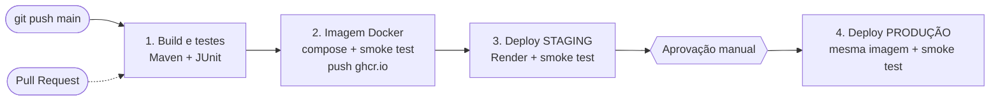
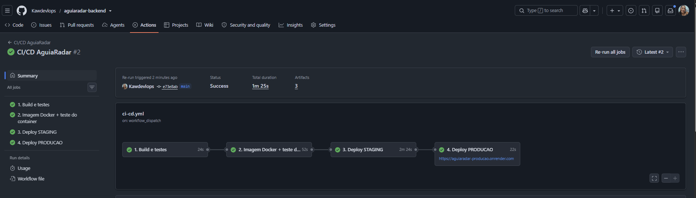
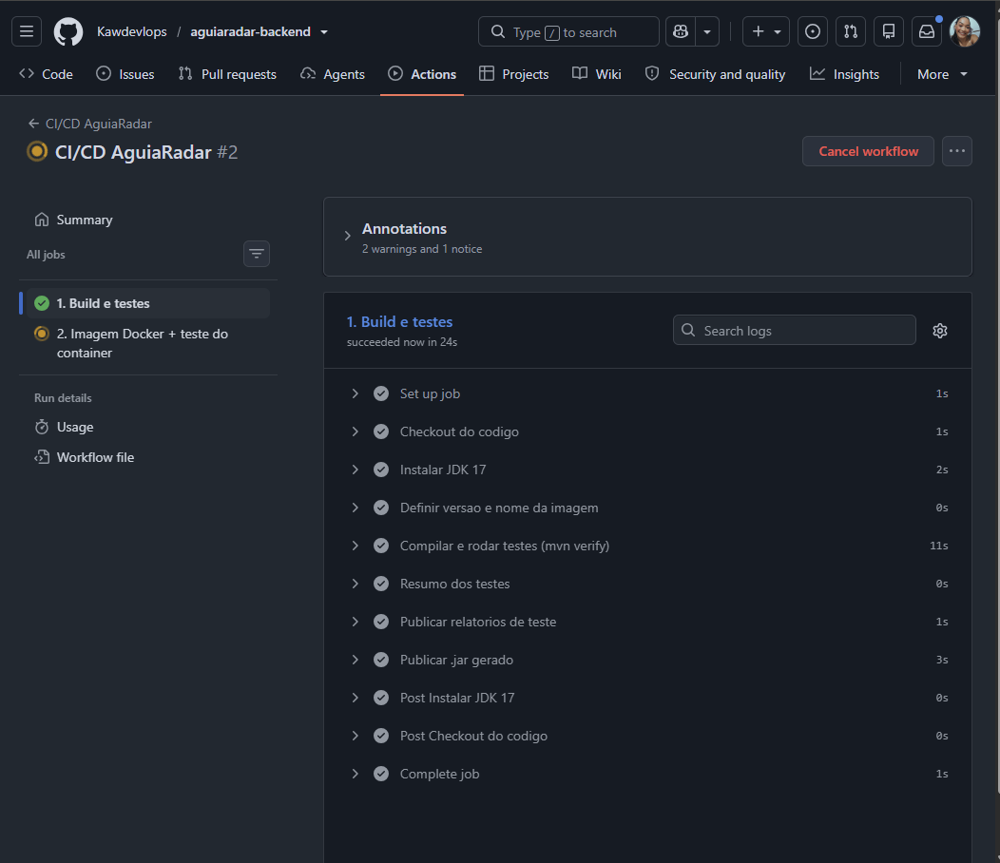
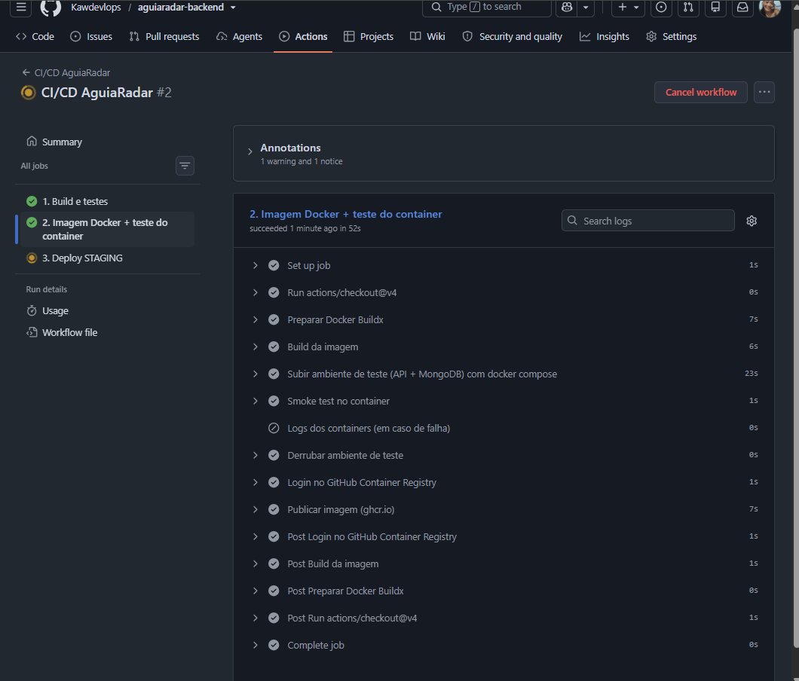
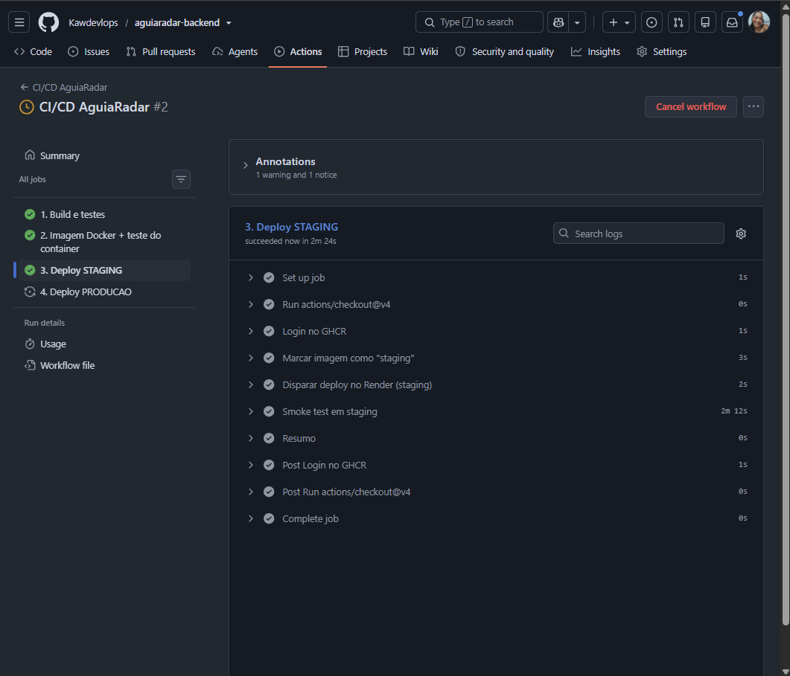
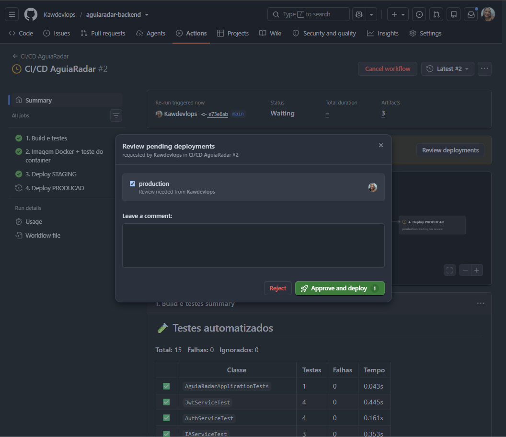
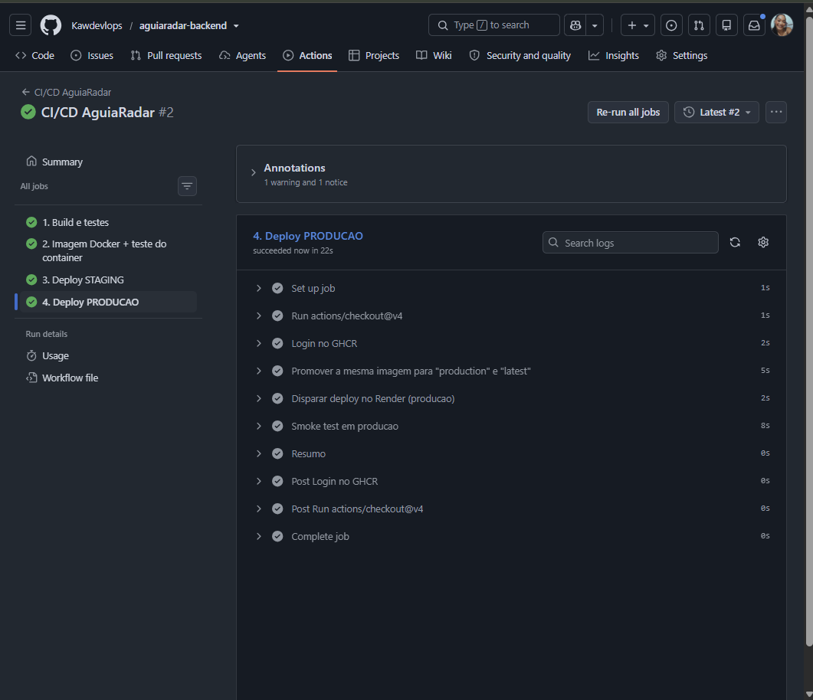
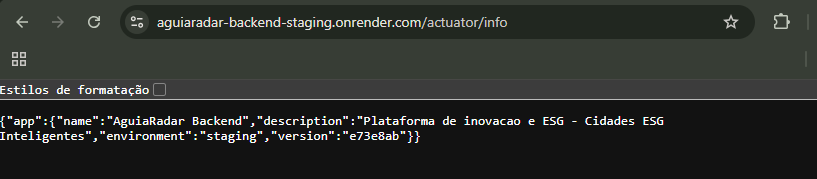
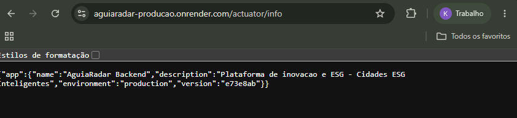

# Projeto - Cidades ESG Inteligentes · AguiaRadar

> **Integrantes:** _Douglas Ferreira Giatti	(565712)_ · _Eduardo de Araujo Favaron (561769)_ · _Lorena Santos Comar (566420)_· _Kauany Soares Rodrigues Violin (564605)_ · _Marcos Pelizari (564883)_ 

O **AguiaRadar** é o backend (Java 17 + Spring Boot 3.3 + MongoDB) de uma plataforma de inovação voltada a ESG: colaboradores cadastram ideias, gestores as avaliam e priorizam (com apoio de IA) e a liderança acompanha projetos e indicadores (ROI, investimento, produtividade) em dashboards. Nesta fase o projeto recebeu práticas completas de DevOps: containerização, orquestração com Docker Compose e um pipeline de CI/CD no GitHub Actions com deploy automatizado em **staging** e **produção**.



---

## Como executar localmente com Docker

**Pré-requisitos:** Docker Desktop (ou Docker Engine) com Docker Compose v2.

```bash
# 1. Clonar e entrar na pasta
git clone https://github.com/<SEU_USUARIO>/<SEU_REPO>.git
cd <SEU_REPO>

# 2. Criar o arquivo de variáveis a partir do modelo
cp .env.example .env          # Windows (PowerShell): copy .env.example .env

# 3. Subir API + MongoDB (o --wait só libera quando os dois estiverem "healthy")
docker compose up -d --build --wait

# 4. Conferir
docker compose ps
curl http://localhost:8080/actuator/health     # {"status":"UP",...}
curl http://localhost:8080/actuator/info       # ambiente e versão
./scripts/smoke-test.sh http://localhost:8080  # login + rota protegida
```

A API fica em `http://localhost:8080`. Usuários de demonstração criados automaticamente: `operador@aguiaradar.com`, `gestor@aguiaradar.com` e `lideranca@aguiaradar.com`, todos com a senha `123456`.

Comandos úteis:

```bash
docker compose logs -f backend   # acompanhar logs da API
docker compose down              # parar (mantém os dados no volume)
docker compose down -v           # parar e apagar os dados do MongoDB
```

### Simulando staging e produção na própria máquina

O mesmo `docker-compose.yml` sobe ambientes isolados (containers, rede e volume próprios) apenas trocando o arquivo de variáveis:

```bash
cp .env.staging.example .env.staging
cp .env.production.example .env.production

docker compose -p aguiaradar-staging --env-file .env.staging    up -d --build --wait   # porta 8081
docker compose -p aguiaradar-prod    --env-file .env.production up -d --build --wait   # porta 8082

curl http://localhost:8081/actuator/info   # "environment":"staging"
curl http://localhost:8082/actuator/info   # "environment":"production"
```

---

## Pipeline CI/CD

**Ferramentas:** GitHub Actions (orquestração do pipeline), Maven (build e testes), Docker Buildx (imagem), GitHub Container Registry – GHCR (registro das imagens), Render (hospedagem dos ambientes staging e produção), MongoDB Atlas (banco gerenciado de cada ambiente) e GitHub Environments (segredos por ambiente e aprovação manual).

O arquivo está em [`.github/workflows/ci-cd.yml`](.github/workflows/ci-cd.yml).

| # | Job | Quando roda | O que faz |
|---|-----|-------------|-----------|
| 1 | **Build e testes** | PR e push na `main` | Instala o JDK 17 com cache do Maven, executa `mvn clean verify` (compilação + testes JUnit 5/Mockito), gera um resumo dos testes na página da execução e publica os relatórios e o `.jar` como artefatos. |
| 2 | **Imagem Docker + teste do container** | PR e push na `main` | Constrói a imagem (com cache), sobe **API + MongoDB reais** com `docker compose --wait` e roda o `scripts/smoke-test.sh` (health, versão, login JWT, rota protegida com e sem token). Em push na `main`, publica a imagem em `ghcr.io/<usuario>/aguiaradar-backend:sha-<commit>`. |
| 3 | **Deploy STAGING** | Push na `main` | Marca a imagem com a tag `staging`, dispara o *deploy hook* do Render passando a imagem exata do commit e aguarda até que `/actuator/info` responda com a nova versão; em seguida roda o smoke test na URL pública. |
| 4 | **Deploy PRODUÇÃO** | Após staging OK + **aprovação manual** | Promove **a mesma imagem** já validada (tags `production` e `latest`), dispara o deploy hook de produção e roda o smoke test. |

Lógica e decisões:

- **Build once, deploy many:** a imagem é gerada uma única vez e promovida entre ambientes, então o que chega em produção é exatamente o que foi testado em staging.
- **Portões de qualidade:** cada job depende do anterior (`needs`); se um teste falhar, nada é publicado nem implantado. Pull Requests executam só as etapas 1 e 2, servindo como validação antes do merge.
- **Verificação real do deploy:** o pipeline não considera o deploy concluído ao apenas chamar o Render; ele espera o `/actuator/info` retornar a versão (SHA do commit) recém-publicada e só então testa login e rotas.
- **Segredos fora do código:** `RENDER_DEPLOY_HOOK` fica em *secrets* de cada GitHub Environment; `MONGODB_URI` e `JWT_SECRET` ficam nas variáveis de ambiente do Render. O repositório só contém arquivos `*.example`.
- **Aprovação para produção:** o environment `production` tem *Required reviewers*, então o job 4 pausa até alguém aprovar no GitHub.
- `concurrency` impede dois deploys simultâneos no mesmo ambiente.

### Configuração do deploy (feita uma única vez)

1. **MongoDB Atlas (gratuito):** crie um cluster M0, um usuário de banco e libere `0.0.0.0/0` em *Network Access*. Copie a connection string e use dois bancos diferentes: `.../aguiaradar_staging` e `.../aguiaradar_prod`.
2. **Primeiro push:** envie o projeto para o GitHub. Os jobs 1 e 2 passam e publicam a imagem no GHCR (o job 3 falha porque ainda não há segredos — é esperado). Em *Seu perfil → Packages → aguiaradar-backend → Package settings*, mude a visibilidade para **Public** para que o Render consiga baixar a imagem.
3. **Render (gratuito):** crie dois *Web Services* do tipo **Existing Image** com `ghcr.io/<usuario>/aguiaradar-backend:staging` e `...:production`, plano Free, e configure as variáveis:

   | Variável | Staging | Produção |
   |---|---|---|
   | `SPRING_PROFILES_ACTIVE` | `staging` | `prod` |
   | `APP_ENV` | `staging` | `production` |
   | `PORT` | `8080` | `8080` |
   | `MONGODB_URI` | URI do Atlas `/aguiaradar_staging` | URI do Atlas `/aguiaradar_prod` |
   | `JWT_SECRET` | `openssl rand -base64 48` | outro valor, diferente do staging |
   | `SEED_ENABLED` | `true` | `true` |

   Em *Settings*, defina *Health Check Path* = `/actuator/health` e copie o **Deploy Hook** de cada serviço.
4. **GitHub → Settings → Environments:** crie `staging` e `production`. Em cada um, adicione o secret `RENDER_DEPLOY_HOOK` (hook do serviço correspondente) e a variable `APP_URL` (ex.: `https://aguiaradar-staging.onrender.com`). No `production`, marque **Required reviewers** com seu usuário.
5. Em *Actions → CI/CD AguiaRadar → Run workflow* (ou num novo push), o pipeline completo roda até produção.

> No plano gratuito o Render "adormece" o serviço após inatividade; o smoke test espera até 10 minutos para cobrir o tempo de inicialização.

---

## Containerização

### Dockerfile

```dockerfile
# syntax=docker/dockerfile:1.7
# =====================================================================
#  AguiaRadar Backend - Dockerfile multi-stage
#  Estagio 1 (build): compila com Maven + JDK 17
#  Estagio 2 (runtime): so o JRE 17 + o .jar (imagem pequena e segura)
# =====================================================================

# ---------- Estagio 1: build ----------
FROM maven:3.9-eclipse-temurin-17 AS build
WORKDIR /app

# Copia so o pom primeiro: se o pom nao mudar, o Docker reaproveita
# a camada de dependencias (build muito mais rapido)
COPY pom.xml .
RUN --mount=type=cache,target=/root/.m2 mvn -B -q dependency:go-offline

COPY src ./src
# Os testes rodam no pipeline (job "build-test"); aqui so empacotamos
RUN --mount=type=cache,target=/root/.m2 mvn -B -q clean package -DskipTests

# ---------- Estagio 2: runtime ----------
FROM eclipse-temurin:17-jre-alpine AS runtime

LABEL org.opencontainers.image.title="aguiaradar-backend" \
      org.opencontainers.image.description="AguiaRadar - Cidades ESG Inteligentes (Spring Boot + MongoDB)" \
      org.opencontainers.image.licenses="MIT"

WORKDIR /app

# Usuario sem privilegios de root (boa pratica de seguranca)
RUN addgroup -S app && adduser -S app -G app
COPY --from=build --chown=app:app /app/target/aguiaradar-backend.jar app.jar
USER app

# Versao gravada na imagem (o pipeline passa o SHA do commit)
ARG APP_VERSION=dev
ENV APP_VERSION=${APP_VERSION} \
    PORT=8080 \
    JAVA_OPTS="-XX:MaxRAMPercentage=60 -XX:+UseContainerSupport -Djava.security.egd=file:/dev/./urandom"

EXPOSE 8080

# O Docker marca o container como "healthy" so quando a API responde
HEALTHCHECK --interval=15s --timeout=5s --start-period=60s --retries=5 \
  CMD wget -qO- "http://localhost:${PORT}/actuator/health" | grep -q '"UP"' || exit 1

ENTRYPOINT ["sh", "-c", "exec java $JAVA_OPTS -jar app.jar"]
```

Estratégias adotadas:

- **Multi-stage build:** o estágio `build` usa a imagem do Maven com JDK para compilar; o estágio final usa só `eclipse-temurin:17-jre-alpine` com o `.jar`. A imagem final não carrega Maven, código-fonte nem JDK, ficando bem menor e com menos superfície de ataque.
- **Cache de camadas:** o `pom.xml` é copiado antes do `src/` e as dependências são baixadas numa camada própria (com `--mount=type=cache`), então alterações só no código não baixam tudo de novo. No pipeline, o cache do Buildx é guardado no GitHub Actions (`type=gha`).
- **Usuário não-root:** a aplicação roda como usuário `app`, sem privilégios.
- **Healthcheck:** o Docker consulta `/actuator/health`; o Compose usa isso para só iniciar a API depois do MongoDB estar pronto e o pipeline usa `--wait` para aguardar o estado *healthy*.
- **Configuração por ambiente:** nada de senha ou URL fixa na imagem; tudo vem de variáveis (`MONGODB_URI`, `JWT_SECRET`, `SPRING_PROFILES_ACTIVE`, `PORT`...). A versão (SHA do commit) é gravada na imagem via `ARG APP_VERSION` e exposta em `/actuator/info`.
- **JVM ciente do container:** `-XX:MaxRAMPercentage=60` limita o heap à memória do container (importante no plano de 512 MB do Render).
- **`.dockerignore`:** evita enviar `target/`, `.git/`, `.env` e documentação para o contexto de build.

### Orquestração (docker-compose.yml)

| Recurso | Como foi usado |
|---|---|
| **Serviços** | `backend` (imagem da aplicação) e `mongodb` (`mongo:7` com usuário/senha root). |
| **Rede** | `backend-net` (bridge): a API acessa o banco pelo nome `mongodb`, sem depender de IP. |
| **Volume** | `mongo_data` montado em `/data/db`, os dados sobrevivem a `docker compose down`. |
| **Variáveis de ambiente** | Lidas do `.env` (modelo em `.env.example`), com valores padrão e `JWT_SECRET` obrigatório (`${JWT_SECRET:?...}`). |
| **Dependência saudável** | `depends_on: condition: service_healthy` → a API só sobe com o Mongo respondendo ao `ping`. |
| **Healthchecks** | Nos dois serviços; permitem `docker compose up --wait`. |
| **Multiambiente** | `-p` + `--env-file` criam stacks isoladas de staging (8081) e produção (8082) com o mesmo arquivo. |

---

## Prints do funcionamento

> Substitua as imagens abaixo pelas suas capturas (lista completa em [`docs/prints/LEIA-ME.md`](docs/prints/LEIA-ME.md)).

**Links dos ambientes**

- Staging: `https://<seu-servico-staging>.onrender.com/actuator/info`
- Produção: `https://<seu-servico-producao>.onrender.com/actuator/info`
- Execução do pipeline: `https://github.com/<SEU_USUARIO>/<SEU_REPO>/actions`

**Pipeline completo**


**Build e testes**


**Imagem Docker + smoke test do container**


**Deploy em staging**


**Aprovação e deploy em produção**



**Ambientes no ar**




**Docker Compose local**


---

## Tecnologias utilizadas

**Aplicação:** Java 17, Spring Boot 3.3 (Web, Security, Validation, Actuator), Spring Data MongoDB, JWT (JJWT 0.12), Lombok, integração com IA via OpenRouter (API compatível com OpenAI) com fallback heurístico local.

**Banco de dados:** MongoDB 7 (local em container) e MongoDB Atlas (staging e produção).

**Testes:** JUnit 5, Mockito, AssertJ, Spring Security Test e smoke test em shell (`scripts/smoke-test.sh`).

**DevOps:** Git e GitHub, GitHub Actions, GitHub Environments (segredos e aprovação), Docker (multi-stage), Docker Compose v2, Docker Buildx, GitHub Container Registry (GHCR), Render (hospedagem dos containers), Maven.

---

## Estrutura do projeto

```text
AguiaRadar-Backend/
├── .github/workflows/ci-cd.yml   # pipeline CI/CD
├── Dockerfile                    # imagem multi-stage
├── .dockerignore
├── docker-compose.yml            # API + MongoDB (rede, volume, healthchecks)
├── .env.example                  # variáveis (dev)
├── .env.staging.example          # variáveis (staging local)
├── .env.production.example       # variáveis (produção local)
├── scripts/smoke-test.sh         # teste pós-deploy
├── test-api.sh                   # teste manual de endpoints
├── docs/prints/                  # evidências
├── pom.xml
├── README.md
└── src/
    ├── main/java/br/com/fiap/aguiaradar/   # config, controller, dto, model, repository, security, service
    ├── main/resources/application*.yml     # perfis dev, staging e prod
    └── test/java/...                       # testes automatizados
```

## Sobre a API

Perfis de acesso: `OPERADOR` (cadastra as próprias ideias), `GESTOR` (avalia/prioriza ideias e gerencia projetos) e `LIDERANCA` (orientações estratégicas, acompanhamento e insights de IA). Autenticação stateless com JWT (`Authorization: Bearer <token>`) e senhas com BCrypt.

| Recurso | Endpoints principais |
|---|---|
| Autenticação | `POST /api/v1/auth/login` (público), `POST /api/v1/auth/registrar` (LIDERANCA) |
| Orientações estratégicas | `GET/POST /api/v1/orientacoes-estrategicas`, `GET/PUT/DELETE /{id}` |
| Ideias | `GET/POST /api/v1/ideias`, `GET /minhas`, `PUT /{id}/avaliar`, `PUT /{id}/priorizar` |
| Projetos | `GET/POST /api/v1/projetos`, `PUT /{id}`, `PATCH /{id}/resultados` |
| Dashboard | `GET /api/v1/dashboard/resumo-geral`, `/por-estrategia`, `/insight-ia` |
| IA | `POST /api/v1/ia/priorizar-ideias`, `POST /api/v1/ia/ideias/{id}/pontuar` |
| Observabilidade | `GET /actuator/health`, `GET /actuator/info` (públicos) |

Testes automatizados (`mvn test`, sem precisar de MongoDB): `JwtServiceTest`, `AuthServiceTest`, `OrientacaoEstrategicaServiceTest` e `IAServiceTest`.

---

## Checklist de entrega

| Item | OK |
|---|---|
| Projeto compactado em .ZIP com estrutura organizada | ☑ |
| Dockerfile funcional | ☑ |
| docker-compose.yml ou arquivos Kubernetes | ☑ |
| Pipeline com etapas de build, teste e deploy | ☑ |
| README.md com instruções e prints | ☑ |
| Documentação técnica com evidências (PDF ou PPT) | ☑ |
| Deploy realizado nos ambientes staging e produção | ☑ |
