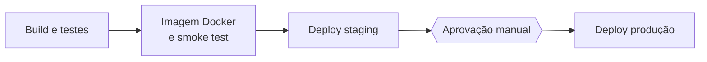
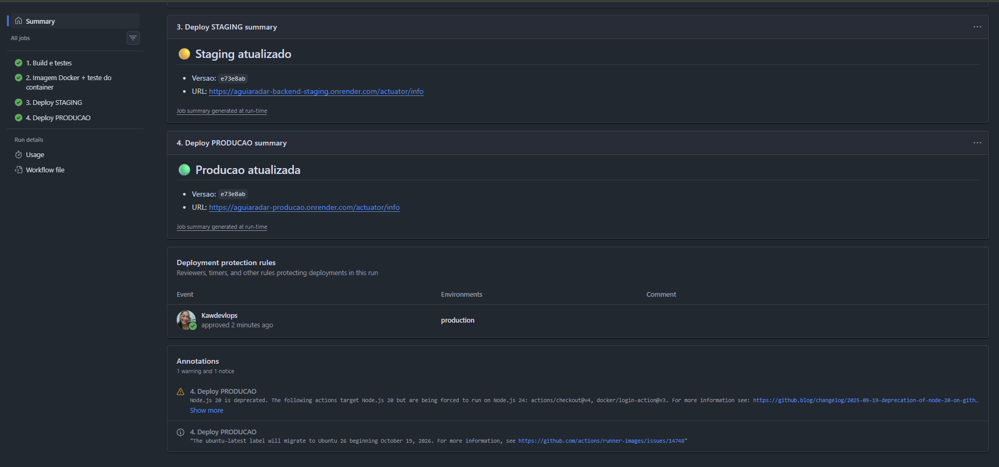
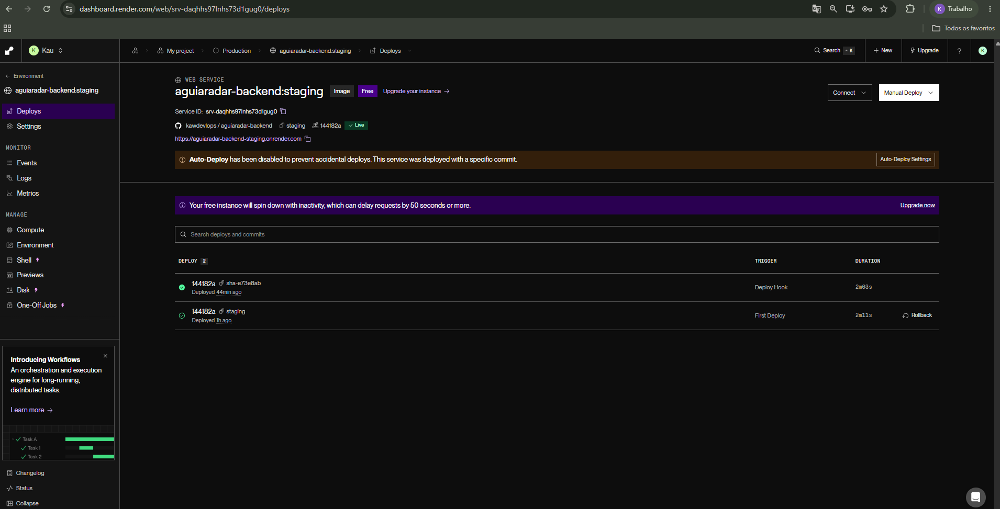
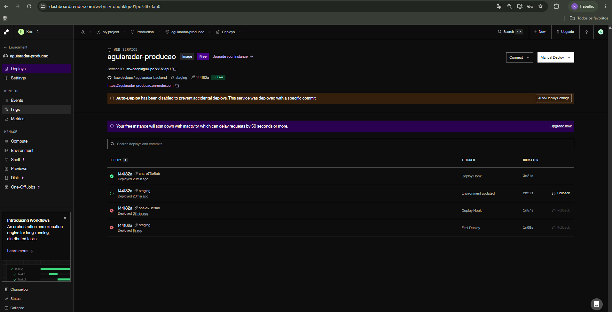
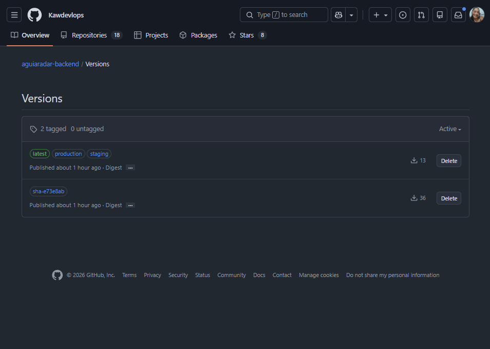

# Projeto - Cidades ESG Inteligentes · AguiaRadar

[](https://github.com/Kawdevlops/aguiaradar-backend/actions/workflows/ci-cd.yml)


Backend da plataforma **AguiaRadar**, voltada à gestão de inovação com foco em ESG. Colaboradores cadastram ideias, gestores avaliam e priorizam com apoio de IA, e a liderança acompanha projetos e indicadores de retorno. O projeto aplica práticas de DevOps de ponta a ponta: containerização, orquestração com Docker Compose e pipeline de CI/CD com deploy automatizado em staging e produção.

| Ambiente | Endereço |
|---|---|
| Staging | [aguiaradar-backend-staging.onrender.com](https://aguiaradar-backend-staging.onrender.com/actuator/info) |
| Produção | [aguiaradar-producao.onrender.com](https://aguiaradar-producao.onrender.com/actuator/info) |
| Pipeline | [GitHub Actions](https://github.com/Kawdevlops/aguiaradar-backend/actions) |
| Imagem Docker | `ghcr.io/kawdevlops/aguiaradar-backend` |

## Integrantes

| Nome | RM |
|---|---|
| Douglas Ferreira Giatti | 565712 |
| Eduardo de Araujo Favaron | 561769 |
| Lorena Santos Comar | 566420 |
| Kauany Soares Rodrigues Violin | 564605 |
| Marcos Pelizari | 564883 |

## Sumário

- [Sobre a aplicação](#sobre-a-aplicação)
- [Como executar localmente com Docker](#como-executar-localmente-com-docker)
- [Pipeline CI/CD](#pipeline-cicd)
- [Containerização](#containerização)
- [Prints do funcionamento](#prints-do-funcionamento)
- [Tecnologias utilizadas](#tecnologias-utilizadas)
- [Estrutura do projeto](#estrutura-do-projeto)

## Sobre a aplicação

API REST stateless com autenticação JWT e três perfis de acesso:

| Perfil | Responsabilidade |
|---|---|
| `OPERADOR` | Cadastra e acompanha as próprias ideias |
| `GESTOR` | Avalia e prioriza ideias, gerencia projetos |
| `LIDERANCA` | Define orientações estratégicas e acompanha indicadores |

| Recurso | Endpoints principais |
|---|---|
| Autenticação | `POST /api/v1/auth/login`, `POST /api/v1/auth/registrar` |
| Orientações estratégicas | `GET/POST /api/v1/orientacoes-estrategicas`, `GET/PUT/DELETE /{id}` |
| Ideias | `GET/POST /api/v1/ideias`, `GET /minhas`, `PUT /{id}/avaliar`, `PUT /{id}/priorizar` |
| Projetos | `GET/POST /api/v1/projetos`, `PUT /{id}`, `PATCH /{id}/resultados` |
| Dashboard | `GET /api/v1/dashboard/resumo-geral`, `/por-estrategia`, `/insight-ia` |
| IA | `POST /api/v1/ia/priorizar-ideias`, `POST /api/v1/ia/ideias/{id}/pontuar` |
| Observabilidade | `GET /actuator/health`, `GET /actuator/info` |

## Como executar localmente com Docker

**Pré-requisitos:** Docker com Docker Compose v2.

```bash
git clone https://github.com/Kawdevlops/aguiaradar-backend.git
cd aguiaradar-backend
cp .env.example .env
docker compose up -d --build --wait
```

A API fica disponível em `http://localhost:8080`. Para validar:

```bash
docker compose ps
curl http://localhost:8080/actuator/health
bash scripts/smoke-test.sh http://localhost:8080
```

Usuários de demonstração criados na inicialização (senha `123456`):

| E-mail | Perfil |
|---|---|
| `operador@aguiaradar.com` | OPERADOR |
| `gestor@aguiaradar.com` | GESTOR |
| `lideranca@aguiaradar.com` | LIDERANCA |

Para encerrar, use `docker compose down` (mantém os dados) ou `docker compose down -v` (remove o volume do banco).

### Staging e produção locais

O mesmo `docker-compose.yml` cria ambientes isolados, cada um com containers, rede e volume próprios:

```bash
cp .env.staging.example .env.staging
cp .env.production.example .env.production
docker compose -p aguiaradar-staging --env-file .env.staging up -d --build --wait
docker compose -p aguiaradar-prod --env-file .env.production up -d --build --wait
```

| Ambiente | Porta | `/actuator/info` |
|---|---|---|
| Staging | 8081 | `"environment":"staging"` |
| Produção | 8082 | `"environment":"production"` |

## Pipeline CI/CD

Implementado com **GitHub Actions** em [`.github/workflows/ci-cd.yml`](.github/workflows/ci-cd.yml). As imagens são publicadas no **GitHub Container Registry** e os ambientes rodam no **Render**, com banco no **MongoDB Atlas**.



| Job | Gatilho | Execução |
|---|---|---|
| 1. Build e testes | Pull request e push na `main` | `mvn clean verify` com JDK 17, testes JUnit 5 e Mockito, relatórios e `.jar` publicados como artefatos |
| 2. Imagem Docker | Pull request e push na `main` | Build da imagem, API e MongoDB reais via `docker compose --wait`, smoke test e push para o GHCR com a tag `sha-<commit>` |
| 3. Deploy staging | Push na `main` | Tag `staging`, deploy no Render via deploy hook e smoke test na URL pública |
| 4. Deploy produção | Aprovação no environment `production` | Promoção da mesma imagem (`production` e `latest`), deploy no Render e smoke test |

**Decisões de projeto**

- **Build once, deploy many:** a imagem é gerada uma única vez e promovida entre ambientes; produção recebe exatamente o que foi validado em staging.
- **Portões de qualidade:** cada job depende do anterior; uma falha interrompe a cadeia antes de qualquer deploy.
- **Verificação real do deploy:** o smoke test aguarda `/actuator/info` reportar a versão recém-publicada e então valida health, login JWT e rotas protegidas.
- **Aprovação manual:** o environment `production` exige revisor antes do deploy.
- **Segredos isolados:** deploy hooks em GitHub Environments; credenciais do banco e do JWT nas variáveis do Render. O repositório contém apenas arquivos `.env.example`.

A configuração dos serviços externos está documentada em [`docs/DEPLOY.md`](docs/DEPLOY.md).

## Containerização

### Dockerfile

[`Dockerfile`](Dockerfile) multi-stage:

| Estágio | Imagem base | Responsabilidade |
|---|---|---|
| `build` | `maven:3.9-eclipse-temurin-17` | Resolve dependências em camada cacheada e empacota o `.jar` |
| `runtime` | `eclipse-temurin:17-jre-alpine` | Executa o `.jar` com usuário sem privilégios |

**Estratégias adotadas**

- Imagem final apenas com JRE e o artefato, sem Maven, JDK ou código-fonte.
- `pom.xml` copiado antes do código para reaproveitar a camada de dependências; cache do BuildKit localmente e cache `gha` no pipeline.
- Execução com usuário `app`, sem privilégios de root.
- `HEALTHCHECK` em `/actuator/health`.
- `-XX:MaxRAMPercentage=60` para respeitar o limite de memória do container.
- Versão (SHA do commit) gravada via `ARG APP_VERSION` e exposta em `/actuator/info`.
- `.dockerignore` excluindo `target/`, `.git/`, `.env` e documentação do contexto de build.

### Docker Compose

| Recurso | Configuração |
|---|---|
| Serviços | `backend` e `mongodb` (`mongo:7` com autenticação) |
| Rede | `backend-net` (bridge), comunicação pelo nome do serviço |
| Volume | `mongo_data` persistindo `/data/db` |
| Dependência | `depends_on` com `condition: service_healthy` |
| Healthchecks | API (`/actuator/health`) e MongoDB (`ping`) |
| Variáveis | Lidas do `.env`, com `JWT_SECRET` obrigatório |

### Variáveis de ambiente

| Variável | Descrição |
|---|---|
| `SPRING_PROFILES_ACTIVE` | Perfil Spring: `dev`, `staging` ou `prod` |
| `APP_ENV` | Nome do ambiente exposto em `/actuator/info` |
| `APP_VERSION` | Versão da aplicação (definida no build pelo pipeline) |
| `PORT` | Porta HTTP (padrão `8080`) |
| `MONGODB_URI` | String de conexão do MongoDB |
| `JWT_SECRET` | Chave Base64 de no mínimo 32 bytes |
| `SEED_ENABLED` | Cria dados de demonstração na inicialização |
| `IA_API_KEY`, `IA_MODEL`, `IA_PROVIDER_URL`, `IA_ENABLED` | Integração opcional com provedor de IA |

## Prints do funcionamento

Execução **#2** do pipeline, commit `e73e8ab`.

**Pipeline completo**




**Build e testes automatizados** (15 testes, 0 falhas)


**Imagem Docker e teste do container**


**Deploy em staging**


**Aprovação e deploy em produção**


**Ambientes em execução** (mesma versão `e73e8ab`)






**Imagem no GitHub Container Registry**



## Tecnologias utilizadas

| Categoria | Tecnologias |
|---|---|
| Linguagem e framework | Java 17, Spring Boot 3.3 (Web, Security, Validation, Actuator), Spring Data MongoDB |
| Segurança | JWT (JJWT 0.12), BCrypt |
| Banco de dados | MongoDB 7 (local), MongoDB Atlas (staging e produção) |
| Testes | JUnit 5, Mockito, AssertJ, Spring Security Test, smoke test em shell |
| Containers | Docker (multi-stage, BuildKit), Docker Compose v2 |
| CI/CD | GitHub Actions, GitHub Environments, GitHub Container Registry |
| Hospedagem | Render |
| Build | Maven |
| IA | OpenRouter (API compatível com OpenAI), com fallback heurístico |

## Estrutura do projeto

```text
aguiaradar-backend/
├── .github/workflows/ci-cd.yml
├── Dockerfile
├── .dockerignore
├── docker-compose.yml
├── .env.example
├── .env.staging.example
├── .env.production.example
├── scripts/smoke-test.sh
├── docs/
│   ├── DEPLOY.md
│   └── prints/
├── pom.xml
└── src/
    ├── main/java/br/com/fiap/aguiaradar/
    ├── main/resources/
    └── test/java/br/com/fiap/aguiaradar/
```
